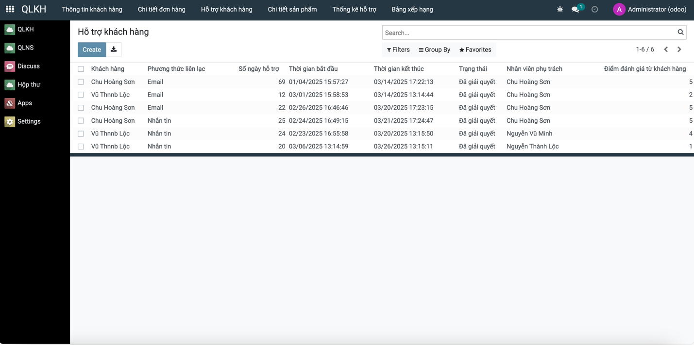

# Quản Lý Khách Hàng

## 1. Giới thiệu

Dự án **Quản Lý Khách Hàng** cung cấp các chức năng chính nhằm hỗ trợ doanh nghiệp trong việc quản lý và chăm sóc khách hàng hiệu quả. Hệ thống giúp theo dõi thông tin khách hàng, hỗ trợ khách hàng, thống kê hiệu suất làm việc của nhân viên và bảng xếp hạng khách hàng mua hàng. Ngoài ra, người dùng còn có thể thêm sản phẩm và đơn hàng của khách hàng.

## 2. Chức năng chính

- **Xem thông tin khách hàng**  
- **Hỗ trợ khách hàng**  
- **Thống kê hỗ trợ của nhân viên**  
- **Bảng xếp hạng khách hàng mua hàng**  

### Chức năng phụ

- **Thêm sản phẩm**  
- **Thêm đơn hàng sản phẩm của khách hàng**  

## 3. Công nghệ sử dụng


[](https://github.com/PyCQA/bandit)

## 4. Cài đặt môi trường

### 4.1. Clone dự án
```sh
git clone https://gitlab.com/Drabula/TTDN-15-04-N8.git
cd TTDN-15-04-N8
```

### 4.2. Cài đặt các thư viện cần thiết
Chạy lệnh sau để cài đặt các thư viện bắt buộc:
```sh
sudo apt-get install libxml2-dev libxslt-dev libldap2-dev libsasl2-dev \
libssl-dev python3.10-distutils python3.10-dev build-essential libffi-dev \
zlib1g-dev python3.10-venv libpq-dev
```

### 4.3. Khởi tạo môi trường ảo
```sh
python3.10 -m venv ./venv
source venv/bin/activate
pip3 install -r requirements.txt
```

## 5. Cấu hình Database
Hệ thống sử dụng PostgreSQL chạy trên Docker. Để khởi tạo database, thực hiện:
```sh
sudo apt install docker-compose
sudo docker-compose up -d
```

## 6. Cấu hình hệ thống

### 6.1. Tạo tệp `odoo.conf`
Tạo tệp `odoo.conf` với nội dung sau:
```ini
[options]
addons_path = addons
db_host = localhost
db_password = odoo
db_user = odoo
db_port = 5434
xmlrpc_port = 8069
```

## 7. Chạy hệ thống

Chạy lệnh sau để khởi động hệ thống:
```sh
python3 odoo-bin.py -c odoo.conf -u all
```
Sau khi chạy xong, truy cập [http://localhost:8069/](http://localhost:8069/) để đăng nhập vào hệ thống.

## 8. Hình ảnh minh họa 📸

### **1. Trang quản lý khách hàng**

> Giao diện quản lý thông tin khách hàng

### **2. Trang hỗ trợ khách hàng**

> Quản lý yêu cầu và phản hồi từ khách hàng

### **3. Trang thống kê hỗ trợ khách hàng**

> Biểu đồ thống kê hiệu suất hỗ trợ khách hàng của nhân viên

### **4. Trang xếp hạng khách hàng**

> Bảng xếp hạng khách hàng theo mức độ mua hàng

### **5. Trang quản lý email và gửi thông báo**

> Giao diện quản lý email và gửi thông báo đến khách hàng

### **6. Trang chi tiết đơn hàng**

> Hiển thị thông tin chi tiết đơn hàng của khách hàng

### **7. Trang chi tiết sản phẩm**

> Thông tin sản phẩm chi tiết dành cho khách hàng

---
**Hoàn tất cài đặt!** 🚀

